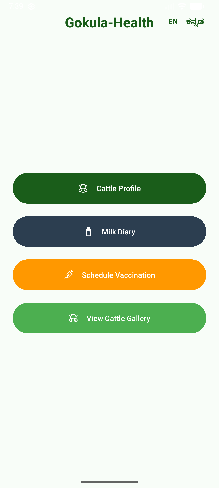
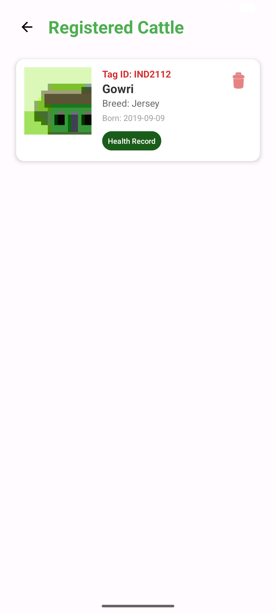
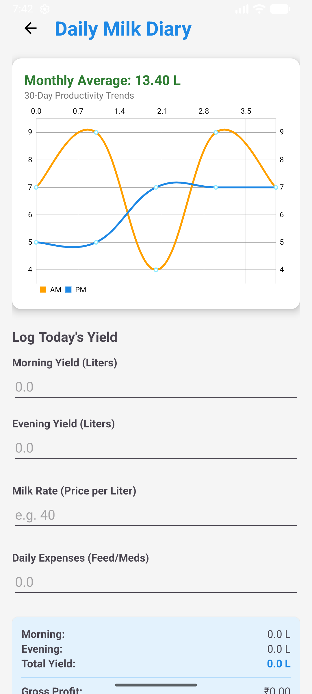

# GokulaHealth — Digital Dairy & Cattle Management System

GokulaHealth is an offline-first, bilingual mobile application engineered for small-scale dairy farmers in rural India to digitize livestock profiles, track daily milk yields, automate micro-economic tracking, and manage veterinary schedules. Built natively using Kotlin and the Jetpack Room database architecture, the application operates 100% without cellular data or internet dependency to achieve complete digital inclusion in remote agricultural zones.

---

## Project Scope & Problem Statement
In rural agricultural ecosystems, smallholders manage highly sensitive livestock assets through manual, paper-based bookkeeping. This operational framework introduces significant business vulnerabilities:
1. **Forgotten Care Windows:** Failure to track vaccination cycles for localized endemic diseases like Foot-and-Mouth Disease (FMD) leads to sudden herd infections and devastating economic losses.
2. **Opaque Profit Realities:** Fluctuations in daily morning and evening milk outputs are obscured when records are scattered across notebooks. Without structured logging, farmers cannot accurately compute true net yields after subtracting feeding and medical expenses.
3. **The Connectivity and Language Barrier:** Most agricultural management software requires constant internet handshakes and relies exclusively on English user interfaces, making them non-functional for local regional farmers.

**GokulaHealth** solves these problems directly by introducing a secure local database application optimized for entry-level consumer mobile hardware. Featuring a runtime language localization layer (English and Kannada) and automatic financial dashboards, it translates daily operational farm tasks into structured, actionable insights.

---

## Key Features & Core Capabilities
* **Cattle Digital Profiles:** Establish unique identities for livestock using national Ear Tag IDs, names, breed lines, and local photo captures.
* **Bilingual Localization Module:** Instantly toggle the interface layout between English and native Kannada without resource resetting.
* **Dual-Yield Milk Diary:** Log precise morning (AM) and evening (PM) production records in liters.
* **Automated Profit Calculator:** Evaluate operational metrics immediately via on-screen accounting summaries tracking gross revenue and net profit.
* **Offline Event Notification Scheduler:** Register critical vaccination targets directly with the device system kernel to fire high-priority reminders even following device reboots.
* **Dynamic Historical Logs:** Access chronological event timelines mapping individual medical records to specific animals.
* **Document Compilation (PDF Export):** Convert historical monthly production tables into standard PDF files saved locally for physical banking reviews or agricultural credit applications.

---

## Architectural Blueprints & Implementation Patterns
The codebase follows clean architecture rules using the **Model-View-ViewModel (MVVM)** design pattern to completely decouple resource-heavy infrastructure processes from layout render handling:
* **UI Layer (View):** Built with fully responsive XML layouts utilizing Material Design 3 guidelines to guarantee clear visibility across various device screen resolutions.
* **Presentation Layer (ViewModel):** Manages asynchronous data pipelines using Kotlin Coroutines and asynchronous Flow streams, ensuring the interface thread remains smooth during intensive reads/writes.
* **Data Layer (Repository/Room DB):** Interfaces with an underlying, highly optimized SQLite engine using the Jetpack Room Persistence library to store relational entities safely on the local storage partition.

---

## Repository Directory Architecture
```text
GokulaHealth/
│
├── app/
│   ├── src/
│   │   ├── main/
│   │   │   ├── java/com/example/gokulahealth/
│   │   │   │   ├── data/                      # Jetpack Room Persistence Layer
│   │   │   │   │   ├── Cattle.kt              # Livestock profile entity model
│   │   │   │   │   ├── GokulaDao.kt           # Data Access Object for Room queries
│   │   │   │   │   ├── GokulaDatabase.kt      # Abstract Room Database configuration
│   │   │   │   │   ├── GokulaRepository.kt    # Data repository abstraction layer
│   │   │   │   │   ├── MilkRecord.kt          # Daily milk yield data model
│   │   │   │   │   └── Vaccination.kt         # Medical treatment data model
│   │   │   │   │
│   │   │   │   ├── viewmodel/                 # Presentation & State Architecture
│   │   │   │   │   └── CattleViewModel.kt     # Manages asynchronous data Flow streams
│   │   │   │   │
│   │   │   │   ├── BaseActivity.kt            # Controls runtime locale configurations
│   │   │   │   ├── LocaleHelper.kt            # Core language tracking utility
│   │   │   │   ├── MainActivity.kt            # Application primary dashboard hub
│   │   │   │   ├── SplashActivity.kt          # App launch presentation screen
│   │   │   │   ├── CattleListActivity.kt      # Displays registered livestock grid
│   │   │   │   ├── CattleAdapter.kt           # View holder adapter for cattle listings
│   │   │   │   ├── CattleRegistrationActivity.kt # Form interface to register animals
│   │   │   │   ├── FullScreenImageActivity.kt # Full-scale profile photo viewer
│   │   │   │   ├── MilkDiaryActivity.kt       # Financial tracking & milk entry diary
│   │   │   │   ├── VaccinationActivity.kt     # Handles target date/time scheduling
│   │   │   │   ├── VaccinationAdapter.kt      # Maps history models to list elements
│   │   │   │   ├── VaccinationHistoryActivity.kt # Animal-specific treatment logging
│   │   │   │   └── VaccinationReceiver.kt     # Handles offline reminder notifications
│   │   │   │
│   │   │   └── res/
│   │   │       ├── drawable/              # Custom vector graphics (ic_cow, ic_milk)
│   │   │       ├── layout/                # Screen view layouts (activity_milk_diary.xml)
│   │   │       ├── values/                # English labels, colors, and default themes
│   │   │       ├── values-kn/             # Native Kannada translation string table
│   │   │       └── xml/                   # FileProvider paths for local PDF sharing
│   │   │
│   │   └── AndroidManifest.xml            # System component routing and permissions
│   │
│   └── build.gradle.kts                   # App module build specifications (Kotlin DSL)
│
├── build.gradle.kts                       # Root project build configurations
├── settings.gradle.kts                    # App module registration files
├── gradle.properties                      # Build environment optimization properties
└── local.properties                       # Machine-specific SDK directory paths
```

---

## Detailed Installation, Setup, and Run Guide
Follow these instructions to check out, configure, build, and launch the application platform on a fresh workstation setup:

### Workstation Prerequisites
* **Integrated Development Environment:** Android Studio Ladybug (2024.2.1) or newer.
* **Software Development Kits:** Android SDK Platform packages supporting API Level 24 through API Level 36.
* **Java Execution Environment:** Java Development Kit (JDK) 17 installed and configured in system path references.
* **Testing Hardware:** A physical Android device with USB Debugging toggled ON, or an active Android Virtual Device (AVD) running an x86_64 or arm64 system image.

### Step 1: Clone the Remote Source Repository
Open your system command terminal interface and pull down the complete codebase using the Git version control system:
```bash
git clone [https://github.com/yourusername/GokulaHealth.git](https://github.com/yourusername/GokulaHealth.git)
```
Navigate directly inside the root directory after downloading:
```bash
cd GokulaHealth
```

### Step 2: Import the Project into Android Studio
1. Launch your instance of **Android Studio**.
2. Select **File > Open** from the top utility layout menu.
3. Browse your local file paths, select the root `GokulaHealth` folder directory, and click **OK**.
4. Allow Android Studio to automatically index internal modules and configure file paths.

### Step 3: Run Gradle Synchronization and Dependency Setup
The application relies on external modular library components. Click the **Sync Project with Gradle Files** elephant icon in the top utility action pane to trigger automated dependency resolution from your `build.gradle.kts` modules:
* **Room Database Core:** `androidx.room:room-runtime` and processing compiler hooks.
* **Lifecycle Extensions:** `androidx.lifecycle:lifecycle-viewmodel-ktx` for async state handling.
* **Coroutines Engine:** `org.jetbrains.kotlinx:kotlinx-coroutines-android` for background worker routines.

### Step 4: Build and Compile the Binary Target
To compile your application binary target, navigate to the top utility menu bar and execute:
* Go to: **Build > Make Project**
* To enforce a completely clean build state, execute: **Build > Clean Project**, followed by **Build > Rebuild Project**.

### Step 5: Deploy and Run on Target Testing Hardware
1. Connect your physical testing device via USB or start a virtual smartphone via the Android Studio **Device Manager**.
2. Ensure the target selector dropdown in the top toolbar displays your active hardware model.
3. Click the green **Run App** chevron arrow (or press `Shift + F10`) to initiate installation.
4. The system will compile the source components, push the application binary archive, and boot the application splash view on screen.

---

## Mathematical Logic Formulas
The application dashboard handles complex fiscal micro-economic aggregates internally on separated worker threads, using structural placeholders to display real-time values dynamically:

$$Gross Revenue = (Morning Yield + Evening Yield) \times Rate Per Liter$$
$$Net Profit = Gross Revenue - Daily Expenses$$

---

## Application Screen Previews
| Core Application Dashboard | Localized Cattle Registry Ledger | Production Entry & Financials Diary |
| :---: | :---: | :---: |
|  |  |  |

---

## Future Enhancements & Scalability Roadmap
Planned features for upcoming iterations of the GokulaHealth application ecosystem include:
* **Voice-Activated Data Logging:** Introducing hands-free audio recording mechanics that interpret local spoken dialects in Kannada and English to let farmers log information easily during manual labor.
* **AI Computer Vision Health Scans:** Using camera inputs to estimate body weight tracking variables and identify signs of visible physical injuries automatically.
* **Advanced Production Graphing:** Rendering completely offline 30-day productivity trends and line curves to visually isolate feed performance patterns.
* **Peer-to-Peer Localized Syncing:** Utilizing Bluetooth or Wi-Fi Direct arrays to allow data to back up between neighboring localized farm nodes without using internet resources.

---

